# 🎓 Manim Animation Agent - Complete Architecture & Features

## 🚀 Project Overview

The **Manim Animation Agent** is an advanced AI-powered system that automatically generates professional educational videos from simple text descriptions. It combines multiple AI models, sophisticated error-correction systems, and automated video generation to create high-quality mathematical and scientific animations using Manim.

### ✨ Key Features
- **Full Automation**: Text → Professional Educational Video
- **AI-Powered**: Google Gemini 2.5 Flash for content generation
- **Self-Healing**: Automatic error detection and correction
- **Learning System**: Improves over time using Mem0.ai
- **Professional Quality**: ElevenLabs voice + Manim animations
- **Cloud-Based**: GitHub Actions + Appwrite infrastructure
- **Multi-Subject**: Math, Physics, Chemistry, Computer Science

## 🏗️ Complete System Architecture

The system follows a sophisticated pipeline that transforms user input into professional educational videos:

### Frontend Layer
- **Next.js Application**: Modern React-based user interface
- **Real-time Updates**: Live progress tracking during generation
- **Appwrite Integration**: Database and file storage connectivity
- **Responsive Design**: Works across devices

### API Layer
- **FastAPI Server**: High-performance Python backend
- **RESTful Endpoints**: `/api/generate`, `/api/status`, `/api/health`
- **Background Tasks**: Asynchronous video processing
- **Error Handling**: Comprehensive error management

### Core Processing Engine
- **Video Planner**: Intelligent scene planning and structure
- **Code Generator**: AI-powered Manim code creation
- **Video Renderer**: Professional video compilation
- **Error Correction**: Self-healing code generation

### Infrastructure
- **GitHub Actions**: Automated CI/CD pipeline
- **Docker Containers**: Scalable processing environment
- **Appwrite Database**: Metadata and file management
- **Cloud Storage**: Secure video hosting

## 🔄 Complete Workflow: From Input to Video

## 🏗️ High-Level Architecture

```mermaid
graph TD
    %% =============================================
    %% CI / AUTOMATION (The Trigger)
    %% =============================================
    subgraph "CI / Automation - GitHub"
        Scheduler("(Scheduled Trigger)") --> Poller["Queue Poller\n(check_video_queue.py)"]
        Poller -->|"Task Found"| VidGenPipeline["Video Generation Pipeline\n(github_video_renderer.py)"]
    end

    %% =============================================
    %% USER-FACING LAYERS
    %% =============================================
    subgraph "User-Facing Layers"
        direction LR
        FE["User Interface\n(React / Tailwind)"] -->|"1. POST /api/generate"| API["FastAPI Controller"]
        FE -->|"Polling: GET /api/status/{id}"| API
    end

    %% =============================================
    %% STATE & STORAGE (The Central Hub)
    %% =============================================
    subgraph "State & Storage - Appwrite"
        AppwriteDB[("Appwrite Database\n(Video & Scene Tasks)")]
        AppwriteBuckets[("Appwrite Buckets\n(Storage)")]
    end
    
    %% Connections to/from Appwrite
    API -->|"2. Create Task"| AppwriteDB
    API -->|"Read/Update Status"| AppwriteDB
    Poller -->|"3. Polls for 'pending' tasks"| AppwriteDB
    VidGenPipeline -->|"Updates status"| AppwriteDB
    FinalVideo -->|"Upload Final Video"| AppwriteBuckets
    Subtitles -->|"Upload Subtitles"| AppwriteBuckets
    Snapshots -->|"Upload Snapshots"| AppwriteBuckets
    ManimCode -->|"Upload Source"| AppwriteBuckets
    AppwriteBuckets -->|"Load Final Video/Assets"| FE

    %% =============================================
    %% MAIN VIDEO GENERATION PIPELINE
    %% =============================================
    subgraph "VideoGenerator Pipeline"
        VidGenPipeline --> Planner["VideoPlanner"]
        Planner --> SceneOutline["Scene Outline"]
        SceneOutline --> Impl["Scene Implementation"]
        Impl --> CodeGen["CodeGenerator"]
        CodeGen --> ManimCode["Manim .py code"]
        
        subgraph "Media Generation"
            ManimCode --> Renderer["VideoRenderer"]
            Renderer --> Manim["Manim CLI"]
            Renderer --> TTS["TTS – ElevenLabs"]
            Manim --> SceneMP4["Scene Video (mp4)"]
            TTS -->|"Audio Track"| Manim
        end
        
        SceneMP4 --> Combiner["Combine Scenes"]
        Renderer -->|"Snapshots (PNG)"| Snapshots
        Combiner --> FinalVideo["Final Video (mp4)"]
        Combiner --> Subtitles["Subtitles (.srt)"]
    end

    %% =============================================
    %% AI & KNOWLEDGE SERVICES
    %% =============================================
    subgraph "AI & Knowledge Services"
        direction LR
        subgraph "LLM Access"
            LLM["LiteLLM Wrapper"] --> ExternalLLMs[("External LLMs\n(Gemini / GPT-4)")]
        end
        subgraph "Knowledge Retrieval"
            RAG["RAGIntegration"] --> VectorStore[("Chroma DB")]
            RAG --> Tavily["Tavily Web Search"]
        end
        subgraph "Agent Memory"
            Mem0["AgentMemory\n(Mem0AI)"]
        end
    end
    
    %% Connections to AI Services
    Planner --> LLM
    Planner --> RAG
    CodeGen --> LLM
    CodeGen --> Tavily
    CodeGen <--> Mem0

    %% =============================================
    %% SELF-CORRECTING ERROR LOOP
    %% =============================================
    subgraph "Self-Correcting Error Loop"
        direction LR
        ErrorHandler["Error Handler"]
    end
    
    Manim -->|"Render Error"| ErrorHandler
    ErrorHandler -->|"Fix with LLM + Tavily + Memory"| CodeGen
    ErrorHandler -->|"Store Successful Fix"| Mem0

```

```mermaid
flowchart TD
    A[👤 User Input via Frontend] --> B[📝 Next.js Frontend UI]
    B --> C[🌐 API Route /api/generate]
    C --> D[🗄️ Appwrite Database Record]
    D --> E[🚀 GitHub Actions Trigger]
    
    E --> F[⚙️ GitHub Workflow Runner]
    F --> G[🐳 Docker Container<br/>Pre-installed Dependencies]
    G --> H[📋 Check Video Queue]
    
    H --> I[🎯 Video Generation Pipeline]
    I --> J[📖 Video Planner]
    I --> K[💻 Code Generator]  
    I --> L[🎬 Video Renderer]
    
    J --> J1[🔍 Scene Outline Generation]
    J1 --> J2[📚 Scene Implementation Plans]
    J2 --> J3[🎨 Vision Storyboards]
    J3 --> J4[🔧 Technical Implementation]
    J4 --> J5[🎵 Animation Narration]
    
    K --> K1[🧠 AI Code Generation<br/>Gemini 2.5 Flash]
    K1 --> K2[❌ Error Detection]
    K2 --> K3[🔍 Tavily Search<br/>Error Solutions]
    K3 --> K4[💾 MemoAI Learning<br/>Pattern Storage]
    K4 --> K5[🛠️ Auto-fix Application]
    
    L --> L1[🎥 Manim Scene Rendering]
    L1 --> L2[🔊 ElevenLabs Voice Generation]
    L2 --> L3[🎞️ Video Combination]
    
    M[📚 RAG System] --> J
    M --> K
    N[🧠 Agent Memory<br/>Mem0.ai] --> K
    O[🔍 Tavily Search] --> K
    P[🗄️ Appwrite Storage] --> Q[📁 File Management]
    
    L3 --> R[☁️ Upload Final Video]
    R --> S[✅ Update Status Complete]
    S --> T[📺 User Access Video]
    
    U[⚠️ Error Handling] --> K2
    U --> V[📊 Error Logging]
    V --> N
    
    style A fill:#e1f5fe
    style B fill:#f3e5f5
    style I fill:#fff3e0
    style J fill:#e8f5e8
    style K fill:#fff8e1
    style L fill:#fce4ec
    style M fill:#f1f8e9
    style N fill:#e3f2fd
    style O fill:#f9fbe7
    style P fill:#fef7ff
```




### Phase 1: User Input & Queueing
1. **User Interface**: User enters educational topic through Next.js frontend
2. **API Processing**: `/api/generate` endpoint receives and validates request
3. **Database Record**: Appwrite creates video record with status "queued_for_render"
4. **GitHub Trigger**: Repository dispatch automatically triggers video generation workflow
5. **Queue Management**: System checks for pending videos and begins processing in order

### Phase 2: Intelligent Video Planning
The **VideoPlanner** (`src/core/video_planner.py`) creates a comprehensive educational structure:

- **Topic Analysis**: AI analyzes the subject matter and educational objectives
- **Scene Outline Generation**: Creates logical flow of educational content
- **Vision Storyboards**: Visual concepts for each animation sequence
- **Technical Implementation**: Specific Manim code requirements
- **Animation Narration**: Educational scripts for voice narration
- **RAG Integration**: Enhanced content using retrieval-augmented generation

**Advanced Features**:
- Context learning from successful video examples
- Automatic plugin detection for advanced Manim features
- Concurrent scene processing for efficiency
- Session management for continuity

### Phase 3: Advanced Code Generation
The **CodeGenerator** (`src/core/code_generator.py`) creates production-ready Manim code:

**AI Code Generation**:
- Gemini 2.5 Flash generates Python/Manim animation code
- Syntax and runtime validation ensures code quality
- Multiple generation strategies for different content types

**Smart Error Handling**:
- **Multi-Level Recovery**: Local fixes → Memory patterns → Web search solutions
- **Pattern Learning**: Successful fixes stored in Mem0.ai for future use
- **Auto-Fix Application**: Corrections applied automatically with validation
- **Visual Self-Reflection**: Analyzes rendered output for quality assurance

**Learning Integration**:
- **Agent Memory**: Stores error-fix patterns for continuous improvement
- **Tavily Search**: Web search for community solutions to coding issues
- **RAG System**: Retrieval of relevant documentation and examples

### Phase 4: Professional Video Rendering
The **VideoRenderer** (`src/core/video_renderer.py`) creates final video output:

**Rendering Pipeline**:
- Individual scene rendering using Manim Community Edition
- Concurrent processing for multiple scenes
- Error recovery with automatic retry logic
- Quality validation and snapshot generation

**Audio Integration**:
- **ElevenLabs Voice**: High-quality AI narration generation
- **Fallback Systems**: gTTS, pyttsx3 for CI/CD compatibility
- **Audio Synchronization**: Perfect timing with visual content
- **Subtitle Generation**: Automatic SRT file creation

**Final Assembly**:
- FFmpeg-based video compilation
- Audio-visual synchronization
- Quality assurance checks
- File upload to cloud storage

## 🧠 AI & Learning Systems

### Primary AI: Google Gemini 2.5 Flash
- **Natural Language Understanding**: Interprets educational topics
- **Code Generation**: Creates complex Python/Manim animations
- **Content Structuring**: Organizes educational flow
- **Error Analysis**: Understands and fixes coding issues

### Agent Memory System (Mem0.ai)
The system continuously learns and improves through advanced memory management:

**Learning Capabilities**:
- **Error-Fix Patterns**: Stores successful error corrections for reuse
- **Code Templates**: Builds library of reusable animation patterns
- **Topic Optimizations**: Improves subject-specific content generation
- **User Preferences**: Learns from successful video characteristics

**Memory Types**:
- Error patterns with fix strategies
- Successful code templates
- Topic-specific knowledge
- Performance optimizations

### RAG System (Retrieval-Augmented Generation)
Enhances content generation with comprehensive knowledge base:

**Knowledge Sources**:
- Manim Community documentation (embedded)
- Code example database
- Mathematical visualization guides
- Animation best practices
- Educational content patterns

### Tavily Search Integration
Advanced error resolution through web search:

**Error Resolution Strategy**:
- Intelligent query generation from error messages
- Web search for similar issues and solutions
- Solution extraction and ranking
- Automatic code fix application
- Pattern storage for future learning

## 🗄️ Database & Storage Architecture

### Appwrite Integration
Comprehensive data management using Appwrite cloud services:

**Database Collections**:
- **Videos**: Main video records with metadata, status, and URLs
- **Scenes**: Individual scene information and rendering progress
- **Agent Memory**: Error patterns and learning data for system improvement

**Storage Buckets**:
- **Final Videos**: Completed MP4 files with public access URLs
- **Scene Videos**: Individual scene outputs for debugging and analysis
- **Subtitles**: SRT caption files for accessibility
- **Source Code**: Generated Python files for transparency and debugging

**Real-time Features**:
- Live progress tracking during video generation
- File versioning for multiple attempts
- Secure access control and sharing
- Automatic storage optimization and cleanup

## 🚀 Infrastructure & Deployment

### GitHub Actions Workflow
Automated CI/CD pipeline using `.github/workflows/video-renderer.yml`:

**Workflow Features**:
- Docker container with pre-installed dependencies
- Environment validation and setup
- Intelligent video queue processing
- 2-hour timeout for complex video generation
- Comprehensive error logging and recovery
- Automatic file upload and status updates

**Container Optimization**:
- Pre-installed Manim, Python packages, and system dependencies
- Eliminates 2-5 minute setup time per video
- Optimized for video processing workloads
- Scalable resource management

### Frontend Architecture
Modern Next.js application with TypeScript:

**Features**:
- Responsive design with Tailwind CSS
- Real-time progress updates via WebSocket/polling
- Appwrite SDK integration for data management
- File download and sharing capabilities
- Comprehensive error handling and user feedback

## 🎯 Educational Content Capabilities

### Supported Subjects
- **Mathematics**: Calculus, Algebra, Geometry, Statistics, Number Theory, Discrete Math
- **Physics**: Mechanics, Waves, Electromagnetism, Thermodynamics, Quantum Physics
- **Chemistry**: Molecular Structures, Chemical Reactions, Periodic Trends, Bonding
- **Computer Science**: Algorithms, Data Structures, Programming Concepts, Complexity Theory

### Animation Types
- **3D Visualizations**: Complex mathematical objects and transformations
- **Graph Animations**: Function plotting, derivatives, integrals, limits
- **Geometric Construction**: Dynamic geometry demonstrations and proofs
- **Interactive Elements**: Step-by-step problem solving and explanations
- **Data Visualization**: Statistical charts, probability distributions, data analysis

### Voice & Audio Features
- **ElevenLabs Integration**: Professional-quality AI narration
- **Multi-language Support**: Various voice options and languages
- **Automatic Subtitles**: SRT file generation for accessibility compliance
- **Audio Synchronization**: Perfect timing with visual content
- **Fallback Systems**: Multiple TTS options for reliability

## 🛠️ Advanced Error Handling & Self-Improvement

### Error Detection Pipeline
The system employs multiple layers of error detection:

1. **Syntax Validation**: Python/Manim code syntax verification
2. **Runtime Testing**: Actual rendering attempts to catch runtime errors
3. **Output Validation**: Generated content quality and completeness checks
4. **Pattern Recognition**: Classification and categorization of error types

### Self-Improvement Mechanisms
The system continuously evolves through:

**Error Pattern Learning**:
- Analysis of error types and frequency
- Storage of successful fix strategies
- Pattern recognition for proactive error prevention
- Performance optimization through learning

**Quality Enhancement**:
- User feedback integration
- Output quality assessment
- Template refinement
- Content improvement over time

### Error Resolution Strategies
Multi-layered approach to error correction:

1. **Memory Lookup**: Check for previously solved similar errors in Mem0.ai
2. **Tavily Search**: Web search for community solutions and documentation
3. **AI Analysis**: Gemini-powered error understanding and solution generation
4. **Fix Application**: Automated code correction with validation
5. **Learning Storage**: Successful patterns stored for future prevention

## 📊 System Performance & Monitoring

### Real-time Tracking
- **Progress Updates**: Live status during video generation process
- **Error Logging**: Comprehensive error tracking and analysis
- **Performance Metrics**: Generation time optimization and monitoring
- **Resource Usage**: Memory, CPU, and storage utilization tracking

### Quality Assurance
- **Automated Testing**: Code validation before rendering attempts
- **Visual Verification**: Output quality assessment and validation
- **Error Recovery**: Multiple retry mechanisms with intelligent fixes
- **Performance Monitoring**: Continuous optimization and improvement

## 🔧 Development & Configuration

### Environment Setup
Required environment variables for system operation:

```bash
# Core Services
APPWRITE_ENDPOINT=https://cloud.appwrite.io/v1
APPWRITE_PROJECT_ID=your_project_id
APPWRITE_API_KEY=your_api_key
GEMINI_API_KEY=your_gemini_key

# Optional Services (Enhanced Features)
ELEVENLABS_API_KEY=your_elevenlabs_key  # Professional voice
TAVILY_API_KEY=your_tavily_key          # Error resolution
MEM0_API_KEY=your_mem0_key              # Agent memory
OPENAI_API_KEY=your_openai_key          # Alternative AI model

# GitHub Actions
GH_PAT=your_github_personal_access_token
GITHUB_REPO_OWNER=your_github_username
GITHUB_REPO_NAME=repository_name
```

### Local Development
```bash
# Setup virtual environment
python -m venv .venv
source .venv/bin/activate  # Linux/Mac
# or .venv\Scripts\activate  # Windows

# Install dependencies
pip install -r requirements.txt

# Run development interfaces
python app.py           # Gradio interface
python api_server.py    # FastAPI server

# Frontend development
cd frontend_example
npm install
npm run dev
```

### Testing & Validation
```bash
# Core functionality tests
python test_video_generation.py
python test_agent_memory.py
python test_appwrite_integration.py
python test_tavily_error_resolution.py

# System integration tests
python test_api_keys.py
python test_deployment.py
```

## 📚 API Documentation

### Core Endpoints

#### Video Generation
- **POST** `/api/generate`
  - Create new video generation task
  - Parameters: `topic`, `description`, `max_scenes`
  - Returns: `task_id`, `status`, `message`

#### Status Tracking  
- **GET** `/api/status/{task_id}`
  - Check generation progress and status
  - Returns: `progress`, `status`, `result`, `error`

#### System Management
- **GET** `/api/health` - System health check and status
- **GET** `/api/stats` - System statistics and performance metrics
- **DELETE** `/api/tasks/{task_id}` - Cancel or delete specific task
- **GET** `/api/tasks` - List all tasks with optional filtering

### Response Formats
```json
{
  "success": true,
  "videoId": "unique_video_id",
  "status": "completed",
  "progress": 100,
  "message": "Video generation completed successfully",
  "result": {
    "videoUrl": "https://storage.url/video.mp4",
    "subtitlesUrl": "https://storage.url/subtitles.srt",
    "duration": 180.5,
    "scenes": 5
  }
}
```

## 🔄 Continuous Improvement

The system continuously evolves through multiple improvement mechanisms:

### Learning Systems
- **Error Pattern Analysis**: Better error prevention and resolution over time
- **Code Template Expansion**: Growing library of reusable animation patterns
- **Performance Optimization**: Faster generation through experience and optimization
- **Quality Enhancement**: Improved output quality through feedback and refinement

### Community & Feedback
- **User Feedback Integration**: System learns from user preferences and feedback
- **Community Contributions**: Open-source development and community improvements
- **Feature Evolution**: New capabilities based on usage patterns and requests
- **Documentation Updates**: Continuous improvement of guides and documentation

## 📄 License & Contributing

### License
This project is licensed under the MIT License - see [LICENSE](LICENSE) for details.

### Contributing Guidelines
We welcome contributions from the community:

- **Fork & Branch**: Create feature branches from the main repository
- **Code Style**: Follow Python PEP 8 guidelines and existing patterns
- **Testing**: Add comprehensive tests for new functionality
- **Documentation**: Update documentation for new features and changes
- **CI/CD**: Ensure all tests pass before submitting pull requests

### Community & Support
- 🐛 **Bug Reports**: Use GitHub Issues for bug reports with detailed information
- 💡 **Feature Requests**: Suggest new features and improvements
- 📖 **Documentation**: Help improve documentation and guides
- 🤝 **Discussions**: Join community discussions and provide feedback
- 🔧 **Development**: Contribute code improvements and new features

---

**Built with ❤️ for Education - Making Complex Concepts Visual and Accessible**

*Transform any educational topic into professional animated videos with the power of AI* 